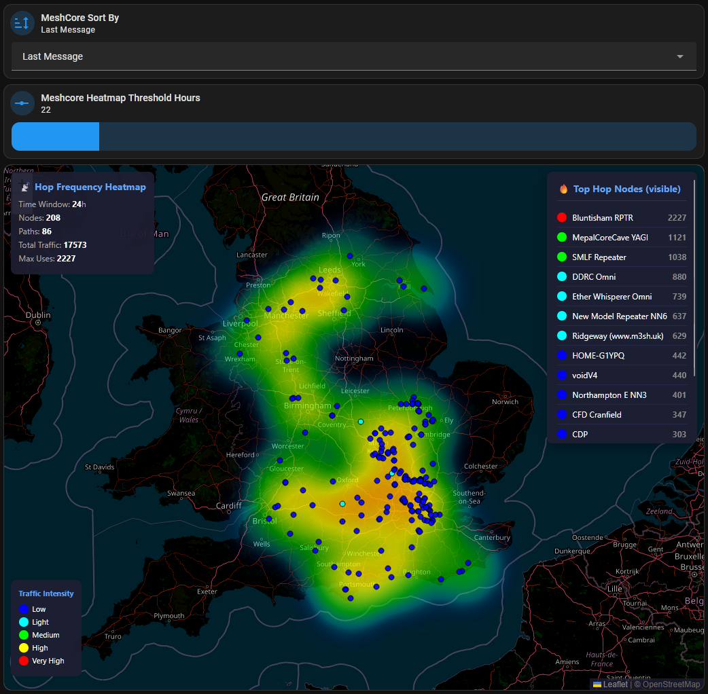
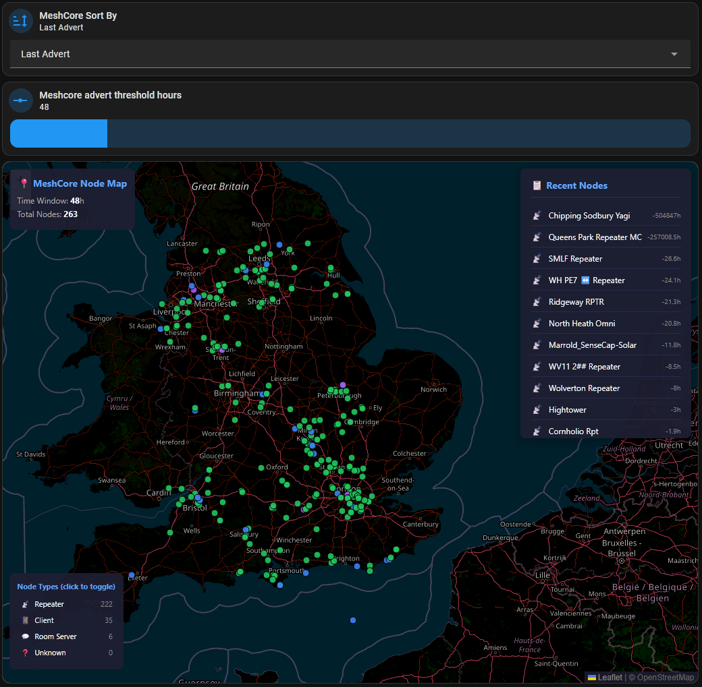
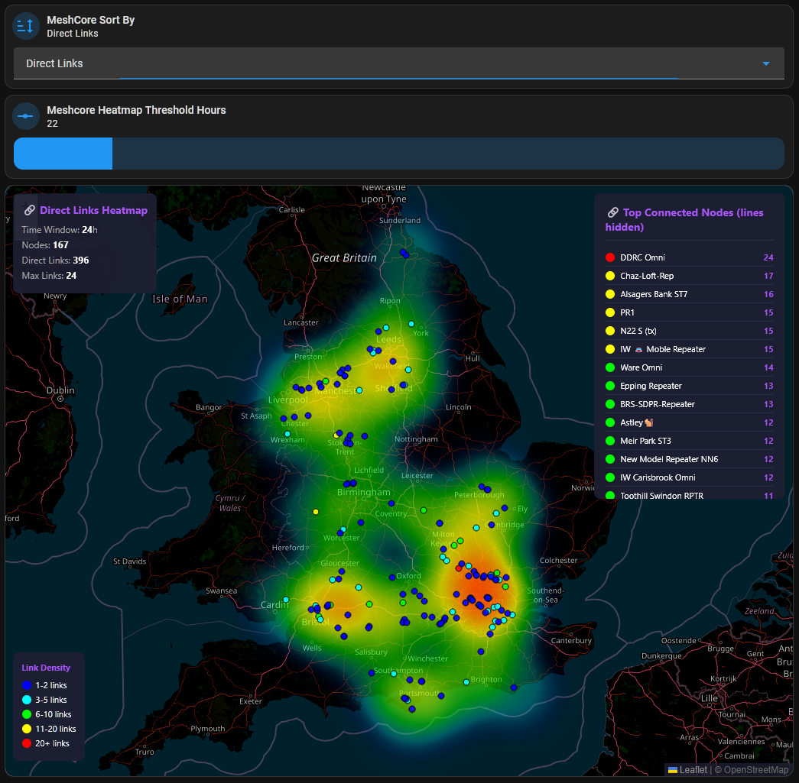

# MeshCore Panel for Home Assistant

[](https://github.com/hacs/integration)

A comprehensive Home Assistant integration for [MeshCore](https://meshcore.co.uk/) mesh networking, featuring interactive maps, heatmaps, signal tracking, and automated contact management.


## Features

### 📍 Interactive Maps
- **Node Map** - Shows all nodes by type (Repeater 📡, Client 📱, Room Server 💬)
- **Hop Frequency Heatmap** - Visualizes which repeaters handle the most traffic
- **Direct Links Heatmap** - Shows 1-hop direct connections between nodes

### 🤖 Automation
- **Auto-greeting** - Welcomes new companions on Public channel
- **Auto-cleanup** - Removes old contacts (30+ days) from HA and device
- **Persistence** - Survives HA reboots

## Installation

### HACS (Recommended)

1. Open HACS in Home Assistant
2. Click on "Integrations"
3. Click the three dots menu → "Custom repositories"
4. Add repository URL: `https://github.com/yourusername/meshcore-ha-panel`
5. Select category: "Integration"
6. Click "Add"
7. Search for "MeshCore Panel" and install
8. Restart Home Assistant
9. Go to Settings → Integrations → Add Integration → "MeshCore Panel"

### Manual Installation

1. Download the latest release
2. Copy `custom_components/meshcore_panel` to your `config/custom_components/` folder
3. Copy contents of `www/` to your `config/www/` folder
4. Restart Home Assistant
5. Go to Settings → Integrations → Add Integration → "MeshCore Panel"

## Configuration

During setup, you'll be asked for:

| Setting | Description |
|---------|-------------|
| **Repeater Pubkey** | First 12 characters of your repeater's public key |
| **Your Name** | Name shown in greeting messages |
| **Enable Greeting** | Auto-greet new contacts on Public channel |
| **Enable Cleanup** | Auto-remove contacts older than 30 days |

## Required Input Helpers

Create these helpers in Home Assistant:

| Helper | Type | Default |
|--------|------|---------|
| `input_number.meshcore_advert_threshold_hours` | Number (1-720) | 12 |
| `input_number.meshcore_messages_threshold_hours` | Number (1-720) | 24 |
| `input_number.meshcore_heatmap_threshold_hours` | Number (1-720) | 168 |

## Dashboard Cards

Add iframe cards for the maps:

```yaml
type: iframe
url: /local/meshcore_heatmap.html
aspect_ratio: "4:3"
```

```yaml
type: iframe
url: /local/meshcore_nodemap.html
aspect_ratio: "4:3"
```

```yaml
type: iframe
url: /local/meshcore_directlinks.html
aspect_ratio: "4:3"
```

## Requirements

- Home Assistant 2024.1+
- [MeshCore Integration](https://github.com/meshcore-dev/meshcore-ha) installed

## Screenshots

### Hop Frequency Heatmap


### Node Type Map


### Direct Links Map


## License

MIT License
